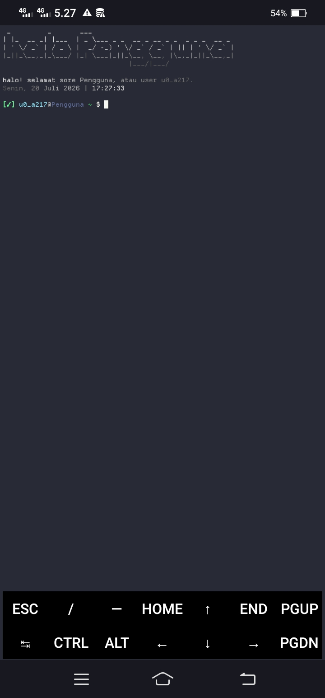
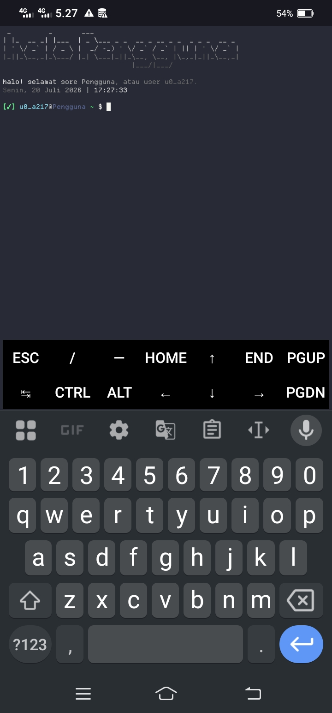

# Skrip .bashrc untuk termux

## 🇮🇩 Buatan Indonesia

Skrip ini dibuat oleh anak bangsa Indonesia. (kece bet gwej 🗿)

## 🌟 Fitur Utama
- ⚡ **Ringan & Cepat:** Berjalan optimal tanpa memakan banyak memori internal.
- 🕒 **Sapaan Dinamis:** Ucapan dan jam *real-time* berbahasa Indonesia sesuai zona waktu.
- ✅ **Smart Prompt:** Terdapat indikator `[✓]` (sukses) dan `[✗]` (error) setiap menjalankan perintah.
- 🎨 **Tampilan Estetik:** Sudah termasuk *font* dan *color scheme* kustom untuk mempercantik Termux.
- 🛠️ **Mudah Disetup:** Proses instalasi yang serba otomatis.

## 🛠️ Cara Instalasi & Penggunaan

*Catatan:* Jika ada pertanyaan di sesi upgrade, maka tekan enter saja.
Ikuti langkah berikut untuk memasang skrip dan tema ini di Termux kamu:

```bash
# 1. Install paket yang dibutuhkan
pkg update && pkg upgrade -y
pkg install figlet -y

# 2. Clone repositori ini
git clone https://github.com/pikri69/termux-thing.git

# 3. Masuk ke direktori proyek
cd termux-thing

# 4. Pindahkan skrip bashrc ke direktori home
cp bashrc.sh ~/.bashrc
cp -r .rc ~

# 5. Buat folder .termux (jika belum ada) lalu pindahkan font & warna
touch ~/.hushlogin
mkdir -p ~/.termux
cp font.ttf ~/.termux/font.ttf
cp colors.properties ~/.termux/colors.properties

# 6. Terapkan tema dan reload pengaturan bash
termux-reload-settings
source ~/.bashrc
```

## ⚙️ Setup Nama dan Zona Waktu

Jika kamu ingin mengubah nama *Pengguna* dan zona waktunya,
maka editlah file `.bashrc` yang ada di direktori home kamu (`~`).

Cari barisan `nama` dan ubah isi variabelnya menjadi nama kamu.
Untuk zona waktu, cari barisan `zona_waktu` dan ubah variabelnya menjadi zona waktu kamu.
*Contoh:* `zona_waktu="Asia/Jakarta"`

## 🚀 Performa skrip

```
real    0m0.313s
user    0m0.177s
sys     0m0.128s
```

## 📸 Preview & Badge

Untuk preview gambar dan badge, lihat di bagian paling bawah ya!

---
<p align="center">Dibuat dengan ❤️ oleh <a href="https://github.com/pikri69">pikri69</a></p>


# .bashrc script for termux

## 🇮🇩 Made in Indonesia

This script was made by an Indonesian.

## 🌟 Key Features
- ⚡ **Lightweight & Fast:** Runs optimally without consuming much internal memory.
- 🕒 **Dynamic Greeting:** Real-time Indonesian greetings and clock according to the time zone.
- ✅ **Smart Prompt:** Features a `[✓]` (success) and `[✗]` (error) indicator for every executed command.
- 🎨 **Aesthetic Look:** Includes custom fonts and color schemes to beautify your Termux.
- 🛠️ **Easy Setup:** Fully automated installation process.

## 🛠️ Installation & Usage

*Note:* If there are prompts during the upgrade session, just press Enter.
Follow these steps to install this script and theme on your Termux:

```bash
# 1. Install required packages
pkg update && pkg upgrade -y
pkg install figlet -y

# 2. Clone this repository
git clone https://github.com/pikri69/termux-thing.git

# 3. Enter the project directory
cd termux-thing

# 4. Move the bashrc script to the home directory
cp bashrc.sh ~/.bashrc
cp -r .rc ~

# 5. Create .termux folder (if it doesn't exist) then move font & colors
touch ~/.hushlogin
mkdir -p ~/.termux
cp font.ttf ~/.termux/font.ttf
cp colors.properties ~/.termux/colors.properties

# 6. Apply theme and reload bash settings
termux-reload-settings
source ~/.bashrc
```

## ⚙️ Name and Timezone Setup

If you want to change the *User* name and the time zone,
edit the `.bashrc` file located in your home directory (`~`).

Find the `nama` (name) line and change the variable to your name.
For the time zone, find the `zona_waktu` line and change the variable to your time zone.
*Example:* `zona_waktu="Asia/Jakarta"`

## 🚀 Script Performance

```
real    0m0.313s
user    0m0.177s
sys     0m0.128s
```

## 📸 Preview & Badge

Here is how Termux looks after using this script:





---
<p align="center">Created with  ❤️ by <a href="https://github.com/pikri69">pikri69</a></p>
